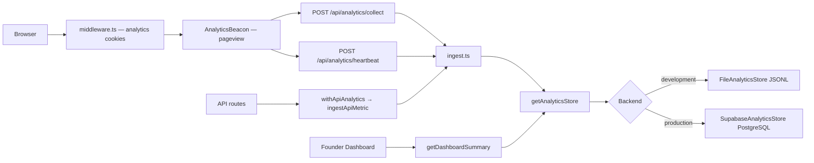

# PitWall analytics architecture

Self-hosted analytics for the Founder Dashboard. No third-party analytics SDKs.

## Data flow



## Storage backends

All ingestion and dashboard code uses the `AnalyticsStore` interface (`src/lib/analytics/store.ts`). Backends are swappable without changing middleware, API routes, or queries.

| Environment | Backend | Persistence |
|-------------|---------|-------------|
| Local `NODE_ENV=development` | `FileAnalyticsStore` | `data/analytics/events.jsonl`, `api-metrics.jsonl` |
| Vercel production | `SupabaseAnalyticsStore` | Supabase PostgreSQL tables |

### Automatic selection

`resolveAnalyticsStoreBackend()` in `src/lib/analytics/get-store.ts`:

1. `ANALYTICS_STORE=file` → always file
2. `ANALYTICS_STORE=supabase` → always Supabase
3. Otherwise: **production** → Supabase, **development** → file

Callers use `getAnalyticsStore()` only.

### Adding a future backend

1. Implement `AnalyticsStore` (see `file-store.ts`, `supabase-store.ts`).
2. Register in `get-store.ts`.
3. Do **not** change `ingest.ts`, `queries.ts`, middleware, or dashboard components.

Examples: Redis (hot counters), ClickHouse (OLAP), dedicated PostgreSQL.

## Supabase schema

Migration (run manually in Supabase SQL Editor):

`supabase/migrations/20260628180000_analytics.sql`

### Tables

| Table | Purpose |
|-------|---------|
| `analytics_events` | Pageviews and heartbeats (mirrors JSONL event shape) |
| `analytics_api_metrics` | Per-route latency, status, errors |
| `analytics_sessions` | Session rollups updated on each event (future dashboards) |

Timestamps are stored as `timestamp_ms` (Unix epoch milliseconds) to match in-app types.

### Indexes

Optimized for dashboard reads:

- Time-range scans (`timestamp_ms DESC`)
- Session / visitor lookups
- API route health aggregates

### Row Level Security

RLS is **enabled** on all analytics tables with **no public policies**. The Supabase service role (server-only) bypasses RLS for writes and reads. Future authenticated admin policies can be added without exposing data to the browser.

## Event payloads

Unchanged:

- Middleware pageview JSON (`type`, `pathname`, `referrer`, `userAgent`, `visitorId`, `sessionId`, `timestamp`)
- Heartbeat JSON (`pathname`, `durationMs`) with cookie-derived IDs
- Classification (`sport`, `routeBucket`, `referrerBucket`, `device`) applied in `build-events.ts`

## Local development

```bash
npm run dev
```

Browse the public site. Events append to `data/analytics/` (gitignored). Open `/admin` to view the Founder Dashboard.

Force Supabase locally:

```bash
ANALYTICS_STORE=supabase
```

(requires Supabase env vars and executed migration)

## Production deployment

1. Create a Supabase project.
2. Run `supabase/migrations/20260628180000_analytics.sql` in the SQL Editor.
3. Set Vercel environment variables (see below).
4. Deploy. Production auto-selects Supabase.

### Verification

1. Visit the public site in a private window.
2. Confirm `POST /api/analytics/collect` returns `{ ok: true }` (not 500).
3. Wait for a heartbeat (~30s) or browse multiple pages.
4. Open `/admin` → Founder Dashboard → pageviews &gt; 0.
5. In Supabase Table Editor, confirm rows in `analytics_events`.

## Environment variables

| Variable | Required | Where |
|----------|----------|-------|
| `NEXT_PUBLIC_SUPABASE_URL` | Production | Server + client (public) |
| `NEXT_PUBLIC_SUPABASE_ANON_KEY` | Production | Server + client (public; not used for analytics writes today) |
| `SUPABASE_SERVICE_ROLE_KEY` | Production | **Server only** — analytics reads/writes |
| `ANALYTICS_STORE` | Optional | Override auto backend (`file` \| `supabase`) |
| `NEXT_PUBLIC_SITE_URL` | Recommended | Referrer classification |

Never expose `SUPABASE_SERVICE_ROLE_KEY` to the browser or `NEXT_PUBLIC_*` bundles beyond what Supabase documents for the anon key.

## Client pageview delivery

Pageviews are sent from `AnalyticsBeacon` when the component mounts and whenever the App Router pathname changes (deduped per pathname). Middleware only issues `pitwall-vid` / `pitwall-sid` cookies; the collect route reads those cookies server-side.

**Update:** Pageviews are sent from `AnalyticsBeacon` on mount and App Router route changes. Middleware only sets analytics cookies.

## Module map

| File | Role |
|------|------|
| `src/middleware.ts` | Cookies + pageview collect |
| `src/components/AnalyticsBeacon.tsx` | Heartbeat client |
| `src/lib/analytics/ingest.ts` | Ingestion entrypoints |
| `src/lib/analytics/queries.ts` | Dashboard aggregation |
| `src/lib/analytics/build-events.ts` | Shared event construction |
| `src/lib/analytics/file-store.ts` | Local JSONL backend |
| `src/lib/analytics/supabase-store.ts` | Production PostgreSQL backend |
| `src/lib/analytics/get-store.ts` | Backend selection |
